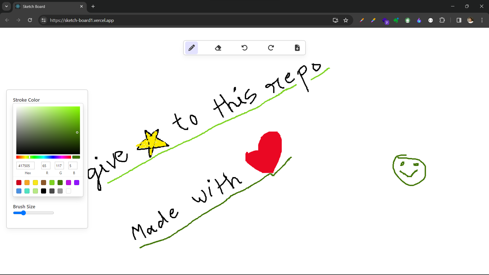

# [Sketch Board](https://sketch-board1.vercel.app/)

## 📌 Introduction

[](https://awesome.re)
Crafted a robust sketch board application using React, JavaScript, CSS, and Canvas API. This dynamic tool boasts essential features like undo, redo, erase, and download functionality, enhancing user creativity and productivity. Leveraging Redux for efficient state management ensures seamless performance and an intuitive user experience.

## 🚀 View Live Demo


<pre><center><a href="https://sketch-board1.vercel.app/"><b>sketch-board1.vercel.app</b></a></center></pre>

## 👨‍💻 Tech Stack Used

-   React
-   React-Redux
-   Tailwind CSS
-   Hooks
-   JavaScript

## 🛠️ Installation Steps

Star and Fork the Repo 🌟 and this will keep us motivated.

1. Clone the repository

```bash
git clone https://github.com/adityaK87/Sketch-Board.git
```

2. Change the working directory

```bash
cd Sketch-Board
```

3. Install dependencies

```bash
npm install
```

4. Run the app

```bash
npm run start
```

## 📸 Screenshots


